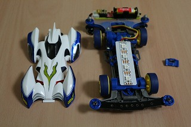

# Shining Scorpion (LED illuminated Mini 4WD)

### [Shining Scorpion](img/Blue.jpg)

## Parts
- [Shining Scorpion Premium](https://www.tamiya.com/japan/products/19436/index.html)
- [CH552E Breakout](https://www.switch-science.com/products/8911)
- [LED Tape (SK6812)](https://akizukidenshi.com/catalog/g/gM-12982/)
- [Grove - Universal 4 Pin Unbuckled Cable](https://www.seeedstudio.com/Grove-Universal-4-Pin-20cm-Unbuckled-Cable-5-PCs-Pack-p-749.html)

## Video
- [シャイニングスコーピオン作ったで](https://www.nicovideo.jp/watch/sm42596636)（Nico-Video）

## Licence
- [NYSL](http://www.kmonos.net/nysl/)

## Pictures

### [Power Off](img/PowerOff.jpg)

### [Red](img/Red.jpg)

### [Inside](img/Opened.jpg)

### [Module](img/Module.jpg)

